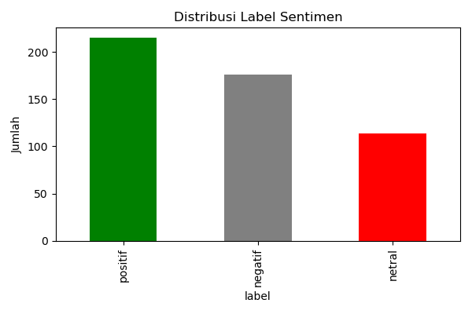
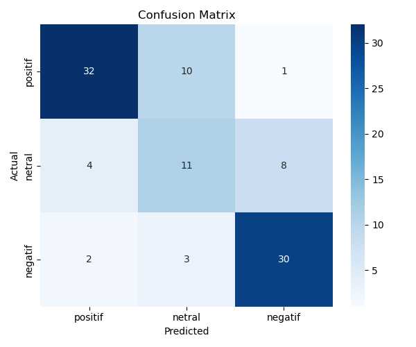

# Sentiment Analysis for Google Play Store Reviews

A Streamlit-based web application that performs **sentiment analysis on Google Play Store reviews** using a machine learning model trained on real user reviews of the **DANA e-wallet app**.

Built with simplicity, Indonesian language support, and practicality in mind.

---

## Features

- **Sentiment Classification**: Predicts sentiment as **Positive**, **Neutral**, or **Negative**  
- **Play Store Integration**: Automatically scrapes reviews using **App ID** or **Play Store URL**  
- **User-Friendly UI**: Clean and intuitive Streamlit interface in **Bahasa Indonesia**  
- **On-Demand Model Training**: Trains an SVM model automatically if no model exists  
- **Interactive Visualization**: Pie chart showing sentiment distribution  
- **Flexible Input**: Accepts both raw App ID (e.g., `id.dana`) and full Play Store links  
- **Custom Review Limit**: Choose how many reviews to analyze (10–200)

---

## Tech Stack

| Component         | Technology |
|------------------|-----------|
| **Framework**     | Streamlit |
| **ML Model**      | SVM + TF-IDF |
| **Preprocessing** | NLTK (Indonesian stopwords), regex |
| **Scraping**      | `google-play-scraper` |
| **Language**      | Bahasa Indonesia (UI & NLP) |

---

## Requirements

- Python 3.7+
- Libraries:  
  `streamlit`, `pandas`, `scikit-learn`, `joblib`, `google-play-scraper`, `nltk`, `matplotlib`

Install dependencies:

```bash
pip install -r requirements.txt
```

> Make sure you have `datasetdana.csv` in the root directory — it contains the labeled training data.

---

## Quick Start

1. Clone or download this repository  
2. Install required packages  
3. Run the app:

```bash
streamlit run app.py
```

4. Open your browser at `http://localhost:8501`

5. **Enter**:
   - App ID (e.g., `id.dana.danabijak`)  
   - **OR** full Play Store URL  
   - Choose number of reviews (10–200)  
   - Click **"Analisis Sentimen"**

6. View results: table + pie chart + summary!

---

## Output

After analysis, you’ll see:
- A **data table** of all processed reviews with predicted sentiment labels  
- A **pie chart** visualizing sentiment distribution  
- A **summary card** showing counts:  
  `Positif | Netral | Negatif`

---

## Technical Details

- **Model**: `SVM (Support Vector Machine)` with `TF-IDF` vectorization  
- **Training Data**: `datasetdana.csv` (500+ real user reviews, manually labeled into 3 classes)  
- **Text Preprocessing**:
  - Lowercasing
  - Remove special characters & numbers
  - Filter Indonesian stopwords (`nltk`)
- **Scraping**: Uses official Play Store API via `google-play-scraper` (no Play Store login needed)

> **Note**: The model is optimized for financial/e-wallet apps like DANA. Accuracy may vary for apps in other domains.

---

## 📊 Exploratory Data Analysis (EDA)

Dataset `datasetdana.csv` berisi **1.000+ ulasan** pengguna aplikasi DANA dengan distribusi sentimen:

- **Positif**: ~55%
- **Negatif**: ~35%
- **Netral**: ~10%



Fitur utama:
- Ulasan dalam **Bahasa Indonesia** (campuran formal & slang)
- Banyak keluhan teknis: *"sistem sibuk"*, *"gagal transfer"*, *"tidak bisa login"*
- Ulasan positif umumnya: *"mudah"*, *"cepat"*, *"membantu"*

Model dilatih dengan **TF-IDF + SVM** dan divalidasi menggunakan **confusion matrix**:



---

## Project Structure

```bash
sentiment-analyst/
├── app.py                  # Main Streamlit application
├── datasetdana.csv         # Labeled training dataset (Indonesian reviews)
├── requirements.txt        # Python dependencies
├── sentiment_model.pkl     # (Auto-generated) trained SVM model
└── README.md
```

---

## License

This project is licensed under the **MIT License** — see [LICENSE](LICENSE) for details.

---

## Contributing

Found a bug? Have an idea for improvement?  
We welcome contributions!

- Open an **Issue** for bug reports or feature requests  
- Submit a **Pull Request** for code enhancements  
- Suggestions for better NLP preprocessing or alternative models are especially appreciated!

---